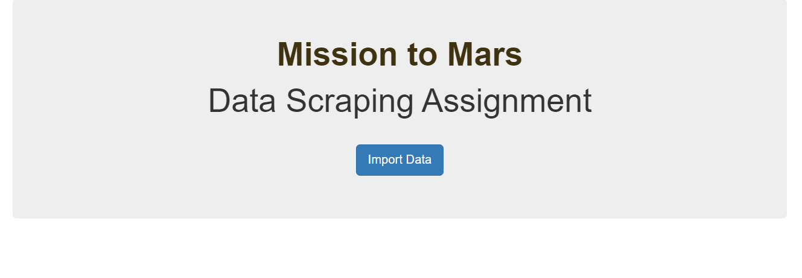
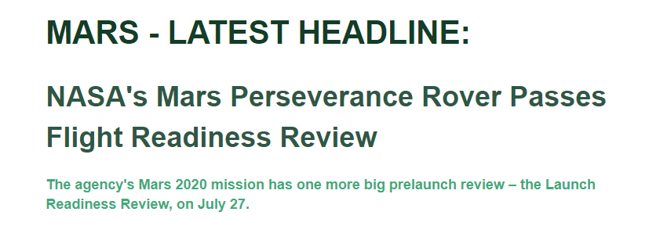
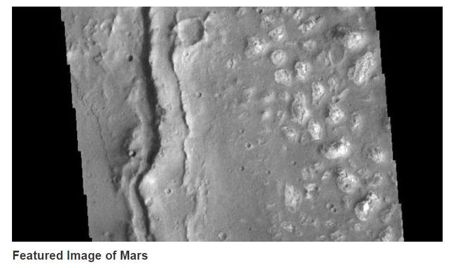
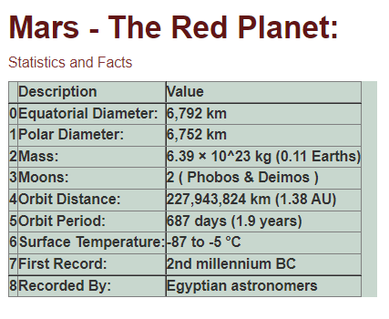
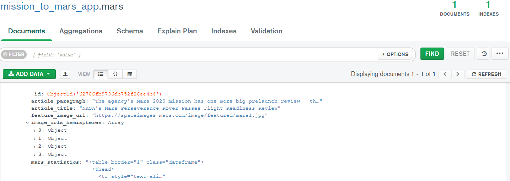

# Web_Scraping_Challenge

    Homework Task 10
    Writen by Chris Burley

## Task Components:

The Web-Scraping project that you are currently viewing comprises the following key components:

a) This ReadMe file
b) A folder of Screen Captures
c) The project folder: Mission to Mars

The latter contains files:

1) app.py   2) Mission_to_Mars.ipynb    3) scrape_mars.py    4) A templates folder

The latter contains a file called index.html
  
# Description:

In this project I have written scripts which, to my knowledge, satisfy every section of the task. 
See screen captures 1 - 6 which I have uploaded to this repository. They show main features that we were required to create.

## Features of final app:

1) A button which imports freshly scraped data to the app.

2) The latest headline from https://redplanetscience.com/, as well as a summary paragraph about the article.

3) The featured image from the aforementioned website.

4) A statistics table about Mars from 'https://galaxyfacts-mars.com/.

5) Thumbnail links to 4 high-resolution hemisphere pictures of Mars from https://marshemispheres.com/.

# Activation of a script:

    (1) To see the scripts which scrape the data, create the mongo database and create the app, locate the scrape_mars, index.html and app.py files. 
 
	(2) To see how how the data was scraped, run the the mission_to_mars.ipynb file in Jupyter.
        It walks you through the process step by step.

        Below is a screen acapture of the mongo database that these files create.

    (3) To run the app.py file you may first need to run "source activate PythonData" in gitbash. Then simply type "python app.py".
        You will then be given a URL to type into chrome.
     
# Support

    For any support with this module, please contact me at chrisjburley@gmail.com
    I would be more than happy to help.

# Contributions

    As this is a piece of work that is going to be assessed, I think that it would be wise for me to suggest that contributions NOT be made to this module.

# Authors and Acknowledgments

    Author - Chris Burley (CJB)
    Thanks to the BSC 24-7 support team for helping on two separate occassions when i got stuck.
    In both instances, there were minute errors in my code that I just couldn't spot without their help. Much appreciated!! 
